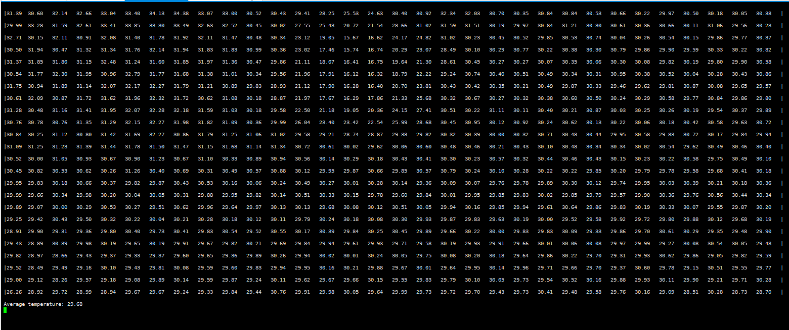
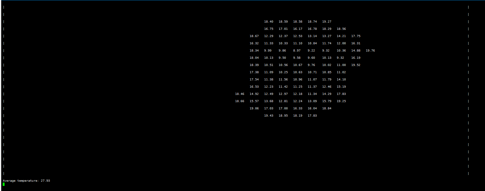
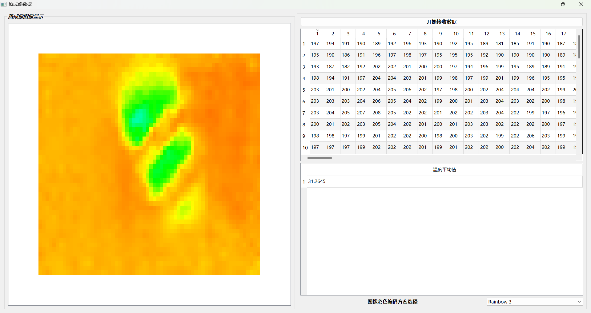

linux-4.1.15

Code based on:
https://github.com/melexis/mlx90640-library

Hardware:
正点原子ATK-DL6Y2C

调用mmap将帧数据对应的内容映射到用户空间。通过ioctl系统调用实现了复位、更改刷新率、测量模式、测量分辨率和刷新帧数据的功能。
获取传感器数据和发送指令都是通过I2C

安装并和设备树匹配成功后，模块信息在/sys/module/mlx90640_i2c_test下，进入parameters目录下，echo 1 > debug可以打开debug信息。

执行 ./mlx90640_app /dev/mlx90640 命令会以二维数组的形式打印计算得到的温度数据：

一种更明显的形式(只显示20.0以下的数据)：

这里放了一杯冰水

温度数据的浮点值是通过 https://github.com/melexis/mlx90640-library 提供的api计算得到的

将温度数据的浮点数通过TCP\IP通信传输至用户界面，用户界面使用C++&QT进行编写，接受到的温度浮点数数组转换成24x32的二维数组并显示在QtableView控件上，并使用双线性插值法以及编码转换将数据转换成8种颜色编码（可以自行选择编码方案）的图像进行显示，最后计算温度浮点数的平均值。界面参考代码在MLX90640QT中

device tree:

&i2c1 {
    clock-frequency = <100000>;
    pinctrl-names = "default";
    pinctrl-0 = <&pinctrl_i2c1>;
    status = "okay";
    mlx90640@33 {
        compatible = "drivertest,mlx90640";
        reg = <0x33>;
    };
};